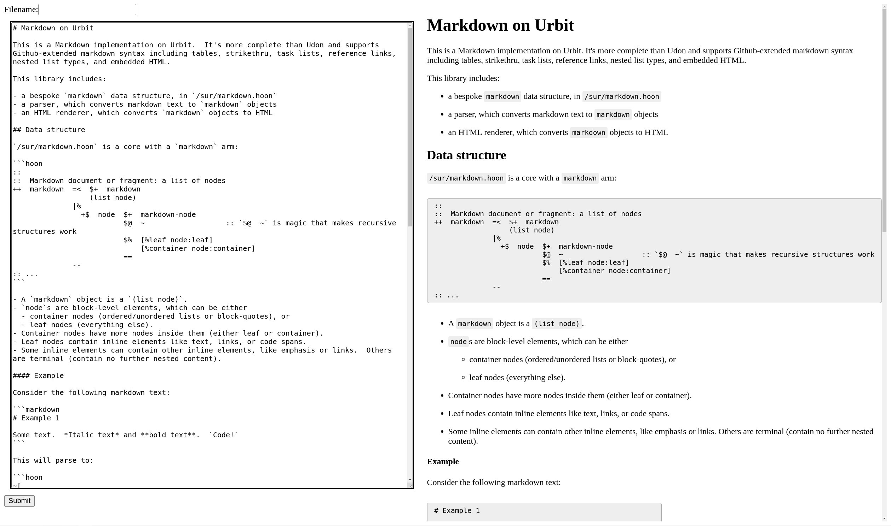

# Markdown on Urbit

This is a Markdown implementation on Urbit.  It's more complete than Udon and supports Github-extended markdown syntax including tables, strikethru, task lists, reference links, nested list types, and embedded HTML.

This library includes:

- a bespoke `markdown` data structure, in `/sur/markdown.hoon`
- a parser, which converts markdown text to `markdown` objects
- an HTML renderer, which converts `markdown` objects to HTML

## Data structure

`/sur/markdown.hoon` is a core with a `markdown` arm:

```hoon
::
::  Markdown document or fragment: a list of nodes
++  markdown  =<  $+  markdown
                  (list node)
              |%
                +$  node  $+  markdown-node
                          $@  ~                   :: `$@  ~` is magic that makes recursive structures work
                          $%  [%leaf node:leaf]
                              [%container node:container]
                          ==
              --
:: ...
```

- A `markdown` object is a `(list node)`.
- `node`s are block-level elements, which can be either
  - container nodes (ordered/unordered lists or block-quotes), or
  - leaf nodes (everything else).
- Container nodes have more nodes inside them (either leaf or container).
- Leaf nodes contain inline elements like text, links, or code spans.
- Some inline elements can contain other inline elements, like emphasis or links.  Others are terminal (contain no further nested content).

#### Example

Consider the following markdown text:

```markdown
# Example 1

Some text.  *Italic text* and **bold text**.  `Code!`
```

This will parse to:

```hoon
~[
  [%leaf [%heading style=%atx level=1 contents=~[[%text text='Example 1']]]]
  [%leaf [%blank-line ~]]
  [ %leaf
    [ %paragraph
        contents
      ~[
        [%text text='Some text.  ']
        [%emphasis emphasis-char='*' contents=[i=[%text text='Italic text'] t=~]]
        [%text text=' and ']
        [%strong emphasis-char='*' contents=[i=[%text text='bold text'] t=~]]
        [%text text='.  ']
        [%code-span num-backticks=1 text='Code!']
        [%soft-line-break ~]
      ]
    ]
  ]
]
```

There are 3 leaf nodes: a `%heading`, a `%blank-line`, and a `%paragraph`.
- The heading has the contents `[%text 'Example 1']`.
- Blank lines have no content (they are blank).
- The paragraph has a series of text elements, some of which are formatted with `%emphasis` and `%strong`, and a `%code-span`.
  - `%emphasis` and `%strong` each have their own contents-- in this case, just one `%text` element each.
  - `%code-span` is a flat element that can only contain unformatted text.

That `markdown` object will render into the following HTML:

```html
<div>
  <h1>Example 1</h1>
  <p>Some text.  <em>Italic text</em> and <strong>bold text</strong>.  <code>Code!</code> </p>
</div>
```

## Usage

The `/lib/markdown.hoon` file is a core with 3 arms: `de`, `en`, and `sail-en`.

A recommended usage pattern is to store data as markdown objects.  This is preferable to storing large `@t`s because if you edit it, only the changed parts with be re-allocated (due to Urbit noun deduplication); the unchanged parts of the object tree will be deduplicated, which means less wasted loom usage.  If you store files as `@t`, any change means the entire thing has to be re-allocated since `@t`s don't have any internal structure that can be deduplicated.

Here's an example of how you can take a piece of markdown text, parse it, and render it as HTML:

```hoon
::  This is how I like to do the imports.
/-  m=markdown      :: `m` is structure types
/+  md=markdown     :: `md` is the parser/formatter core
::
::  Some sample markdown text ('\0a' is a newline)
=/  markdown-text  '# Example 1\0a\0aSome text.  *Italic text* and **bold text**.  `Code!`'
::
::  These are equivalent: invoke parser directly, vs using convenience method
=/  parsed-md=(unit markdown:m)   (de:md markdown-text)       :: Shortcut
=/  parsed-md2=(unit markdown:m)  (rush markdown-text markdown:de:md)  :: Invoking parser directly
::
::  Both return `(unit markdown)` (empty if parsing fails)
?~  parsed-md  !!  :: check for failure
::
::  Convert to a Sail object
=/  unrendered-html=manx  (sail-en:md u.parsed-md)
::
::  Print as HTML
=/  rendered-html=tape  (en-xml:html unrendered-html)
rendered-html
```

***NOTE***: I will refer to the `/lib/markdown.hoon` core as `md`.  This implies that you've imported it as `/+  md=markdown`, or in Dojo, `=md -build-file /=markdown=/lib/markdown/hoon`.  Of course you can call it something else if you want.

### `de:md`

`de:md` parses markdown text into a `markdown` object.

This arm is a big collection of parsers.  The entrypoint is `markdown:de:md`, which is a parser that accepts any markdown text and converts it to a `markdown` object.

Example:

```hoon
(rush '# An example' markdown:de:md)
:: [~ ~[[%leaf [%heading style=%atx level=1 contents=~[[%text text='An example']]]]]]
```

The `de` arm can be called directly on a piece of text, for convenience, which will invoke `rush`:

```hoon
:: Equivalent to above
(de:md '# An example')
:: [~ ~[[%leaf [%heading style=%atx level=1 contents=~[[%text text='An example']]]]]]
```

You can use the parsers directly if you want to parse a `tape` instead of a `@t`, or if you want to use `scan`/`rash` to avoid dealing with units and crashing on failure.  You could even use the individual element / node parser arms directly if you wanted, although I don't know what the point would be.

### `en:md`

`en:md` serializes a `markdown` object into markdown text again.  You can use this if you want to show the user the markdown "plaintext" for a stored markdown object.

It returns a `tape`.

Example:

```hoon
=/  markdown  (need (de:md '# An example'))
(en:md markdown)
:: "# An example\0a"
```

Applying `de:md` and then `en:md` will preserve most formatting, although certain "canonicalization" changes will be applied.  In this case for example, a newline character has been added to the end.  See the "Canonicalization" section below for a list of formatting that isn't preserved or that will be normalized.

### `sail-en:md`

`sail-en:md` converts a `markdown` object into a Sail object (manx) for rendering as HTML.  You can then convert `manx` to an HTML tape using `en-xml:html` from the standard library.

Note: the `manx` returned by `sail-en:md` will have the rendered contents wrapped in a `<div>...</div>` element.  This made some stuff simpler for me.  It also seems logical because you probably want to render a Markdown document in one block.  If you don't like this extra `<div>`, feel free to remove it.

Example:

```hoon
=/  markdown  (need (de:md '# An example'))
(en-xml:html (sail-en:md markdown))
:: "<div><h1>An example</h1></div>"
```

## Demo app

If you install this as a desk, it will create a Markdown tile in Landscape.  That tile links to the `renderer.hoon` app, which provides a demo of how to use this library in a real application.  The `%renderer` app has a simple two-column view, with a textarea input box on the left and the rendered result on the right.

Here's a screenshot of it rendering this README:



## Canonicalization

The following changes will be applied (i.e., these are cases where the original text will not be preserved) when applying canonicalization:

- Numbered list items will be renumbered from `1. 2. 3.` to `1. 1. 1.`
- Block-quote markers ">" that aren't followed by a space will have one inserted
- Inconsistent indentation will be normalized to the level of the start of the element:
  - block-quote ">"s
  - list markers (`1.` and `-`)
- Block-quote soft line continuations will have "> " inserted in front of them
- Newline will be inserted at end of document if there isn't one
